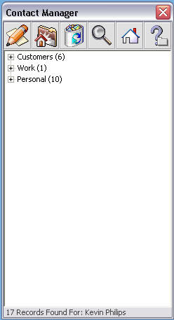



## Excel VBA Contact Manager

### Description

Excel Based database to store contact information for multiple groups, good UI, control example programming, great place to get involved heavily within the Excel environment.
 
### More Info
 

             |
---                |---
**Submitted On**   |2003-10-02 13:38:02
**By**             |[Kevin Philips](https://github.com/Planet-Source-Code/PSCIndex/blob/master/ByAuthor/kevin-philips.md)
**Level**          |Intermediate
**User Rating**    |5.0 (15 globes from 3 users)
**Compatibility**  |VB 5\.0, VB 6\.0, VBA MS Excel
**Category**       |[Microsoft Office Apps/VBA](https://github.com/Planet-Source-Code/PSCIndex/blob/master/ByCategory/microsoft-office-apps-vba__1-42.md)
**World**          |[Visual Basic](https://github.com/Planet-Source-Code/PSCIndex/blob/master/ByWorld/visual-basic.md)
**Archive File**   |[Excel\_VBA\_1653091022003\.zip](https://github.com/Planet-Source-Code/kevin-philips-excel-vba-contact-manager__1-48933/archive/master.zip)

